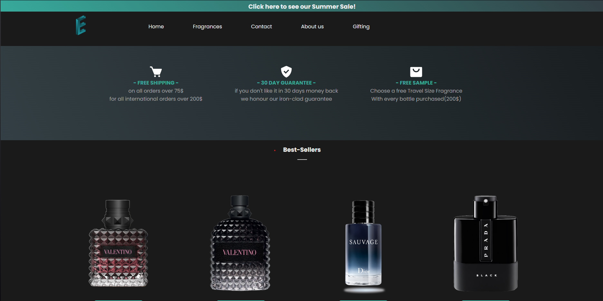
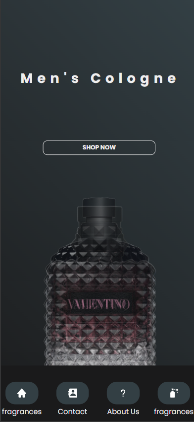

<h1>Responsive website design💻</h1>

a fully responsive fragrance e-commerce website

<h3>About this Project🤷‍♂️</h3>

This project is a responsive e-commerce website designed to provide a seamless experience across all devices.

<a target="_blank" href="https://unrivaled-cat-9182f4.netlify.app/">Demo Project💻</a>

<h2>features</h2>
<ul>
    <li>Responsive Design: Optimized for desktops, tablets, and mobile devices.</li>
    <li>Product Listings: View a variety of products with detailed descriptions and images.</li>
    <li>custom scrollbar and interactive elements</li>
</ul>

<h2>Stuff used🛠</h2>
<ul>
    <li>HTML</li>
    <li>CSS(flexbox, media queries)</li>
    <li>JavaScript</li>
</ul>
<h3>new stuff added</h3>
<ul>
    <li>updated the first section of the landing page</li>
    <li>added scroll animations</li>
    <li>added img slider</li>
    <li>changed the layout</li>
    <li>marquee for the header</li>
    <li>more landing page content</li>
</ul>

<h2>Mobile Responsiveness</h2>

the website is responsive for mobile devices

<h3>and has its own unique features to make the mobile view a better experience
<h3>small contributor's</h3>
<ul>
    <li><a href="https://github.com/ronanru">RonanRU</a></li>
</ul>
